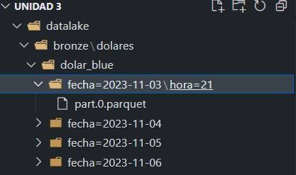
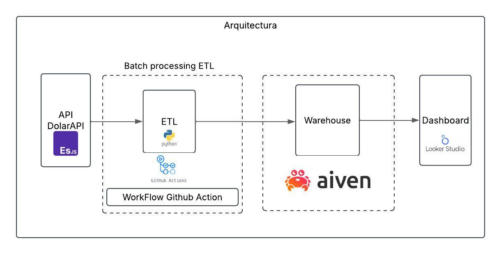

<p align="center">
  
</p>

# Entrega final del trabajo integrador

## La entrega está vinculada a la extracción. procesamiento y almacenamiento de datos.

### Objetivo:
Implementar técnicas de extracción de una API, procesar y almacenamiento de datos en una base de  datos OLAP, mediante el lenguaje de programación Python.

### Consigna:
   Desarrollar un programa en Python que realice la extracción de una API como fuente de datos,  procesamiento para limpiar y estandarizar los datos y cargar los datos en una base de datos OLAP.

  

## Explicación de la realización del proyecto:

### Librerías utilizadas en el proyecto:
1. `pandas`: Para crear DataFrames.
2. `json`: Para analizar JSONs.
3. `datetime`: Para gestionar fechas y tiempos.
4. `requests`: Para realizar solicitudes HTTP.
5. `os`: Para gestionar archivos y directorios.
6. `pyarrow`: Para trabajar con formato parquet.
7. `configparser`: para leer el archivo de las credenciales config.ini.
7. `sqlalchemy`: para crear la conexión a la base de datos postgres

### API, los diferentes endpoints y las técnicas utilizadas:
Seleccione la API de cotización del dólar, ya que se trata de datos temporales que se actualizan de forma recurrente, incluso varias veces al día.
Para este proyecto, se ha utilizado la API "https://dolarapi.com" (cotización del dólar en Argentina) con tres endpoints:
- `"/v1/dolares/oficial"`: Dólar oficial (Técnica de extracción completa, sobrescribiendo el archivo).
- `"/v1/dolares/blue"`: Dólar blue (Técnica de extracción incremental, que agrega nuevos registros al archivo existente en caso de que se actualice la fecha).
- `"/v1/dolares"`: 6 tipos de cambio (Técnica de extracción completa, creando nuevos archivos con fecha y hora en cada ejecución).

### Detalles del código y la lógica del proyecto:
Una vez cargadas todas las librerías y definidos los endpoints, se procede a crear las funciones para todas las tareas a realizar.

Funciones:
- `def build_table(json_data):`: Función que convierte un JSON en un DataFrame.
- `def proceso_agregar_columnas(df):`: Creamos columnas nuevas(fecha y hora).
- `def get_data(base_url, endpoint, params=None):`: Función para obtener los datos, con la URL base y el endpoint como parámetros.
- `def save(df, save_path, partition_cols=None, engine="fastparquet"):`: Guardamos los DataFrame en archivo parquet y su partición en la ruta Bronze y Silver.

     Ejemplo de los archivos y los datos:
       
     


- `def filtrar_convertir_limpiar(df):`: Esta función procesas y limpia los datos para ser enviados a la base de datos.
- `def connect_to_postgres(config_file_path="config.ini", section="postgres"):`: Esta función crea la conexión de la base de datos.

- Para enviar la tabla a la base de datos se hacen consultan sql y el diseño de la base de datos SCD1(Se sobreescribe los datos):
   ```sql
      eng = connect_to_postgres("config.ini", "postgres")
      with eng.begin() as con:
         con.execute("""
         CREATE TABLE IF NOT EXISTS stg_dolares (
            id INT PRIMARY KEY,
            casa VARCHAR(50),
            moneda VARCHAR(50),
            compra DOUBLE PRECISION,
            venta DOUBLE PRECISION,
            fecha DATE,
            hora integer
         );
         CREATE TABLE IF NOT EXISTS  dolares_scd1 (
               id INT PRIMARY KEY,
            casa VARCHAR(50),
            moneda VARCHAR(50),
            compra DOUBLE PRECISION,
            venta DOUBLE PRECISION,
            fecha DATE,
            hora integer,
            fecha_actualizacion_dwh TIMESTAMP
         );
         """)

      tipos_cambio_dolar_parquet_silver = pd.read_parquet('datalake/silver/dolares/tipos_cambio_dolar') 

      with eng.begin() as con:
         con.execute("TRUNCATE TABLE stg_dolares")

         tipos_cambio_dolar_parquet_silver.to_sql("stg_dolares", con,
                              if_exists="append", method="multi",
                              index=False)

         con.execute("""
                  MERGE INTO dolares_scd1
                  USING stg_dolares AS dolares
                  ON (dolares.id = dolares_scd1.id)
                  WHEN MATCHED THEN
                     UPDATE SET
                        casa = dolares.casa,
                        moneda = dolares.moneda,
                        compra = dolares.compra,
                        venta = dolares.venta,
                        fecha= dolares.fecha,
                        hora= dolares.hora,
                        fecha_actualizacion_dwh = CURRENT_TIMESTAMP
                  WHEN NOT MATCHED THEN
                     INSERT (id, casa, moneda, compra, venta, fecha, hora, fecha_actualizacion_dwh)
                     VALUES (
                        dolares.id,
                        dolares.casa,
                        dolares.moneda,
                        dolares.compra,
                        dolares.venta,
                        dolares.fecha,
                        dolares.hora,
                        CURRENT_TIMESTAMP
                     );
                     """)


- Para enviar la tabla a la base de datos se hacen consultan sql y el diseño de la base de datos SCD2(Se agrega un historial de cambio):
  ```sql
    with eng.begin() as con:
    con.execute("""
        CREATE TABLE IF NOT EXISTS dolar_blue_scd2 (
            id_scd2 SERIAL PRIMARY KEY,
            id INT,
            casa VARCHAR(50),
            moneda VARCHAR(50),
            compra DOUBLE PRECISION,
            venta DOUBLE PRECISION,
            fecha_inicio DATE,
            fecha_fin DATE,
            es_actual BOOLEAN)
            """)

   dolar_blue_silver= pd.read_parquet('datalake/silver/dolares/dolar_blue') 

   with eng.begin() as con:
      con.execute("TRUNCATE TABLE stg_dolares")

      dolar_blue_silver.to_sql("stg_dolares", con,
                           if_exists="append", method="multi",
                           index=False)

      con.execute("""
         BEGIN;

         MERGE INTO dolar_blue_scd2
         USING stg_dolares AS dolares
         ON (dolares.id = dolar_blue_scd2.id)
         WHEN MATCHED AND dolares.venta <> dolar_blue_scd2.venta AND dolar_blue_scd2.es_actual = TRUE THEN

         
               UPDATE SET
                  fecha_fin = CURRENT_DATE,
                  es_actual = FALSE
         WHEN NOT MATCHED THEN
               INSERT (id, casa, moneda, compra, venta, fecha_inicio, fecha_fin, es_actual)
               VALUES (
                  dolares.id,
                  dolares.casa,
                  dolares.moneda,
                  dolares.compra,
                  dolares.venta,
                  dolares.fecha,
                  NULL,
                  TRUE
               );

         INSERT INTO dolar_blue_scd2 (id, casa, moneda, compra, venta, fecha_inicio, es_actual)
         SELECT s.id, s.casa, s.moneda, s.compra, s.venta, CURRENT_DATE, TRUE
         FROM stg_dolares s
         LEFT JOIN dolar_blue_scd2 c
         ON s.id = c.id
         WHERE s.venta <> c.venta AND c.es_actual = FALSE;

         COMMIT;
         """)        

## Arquitectura de los datos




## Dashboard en construccón

   

